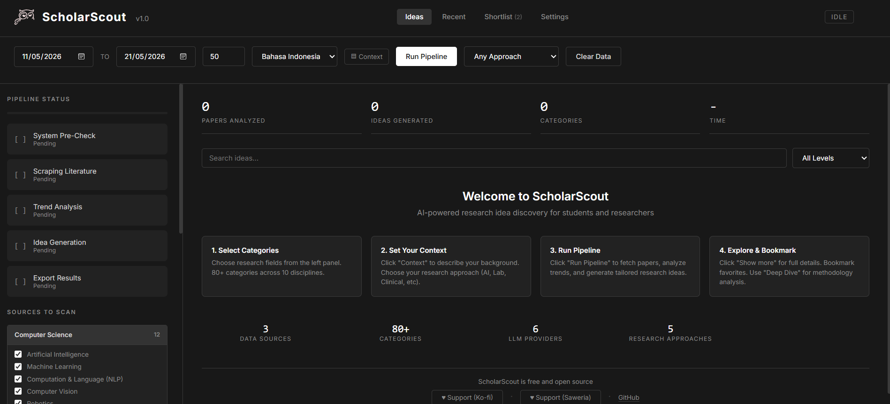

<p align="center">
  
</p>

<h3 align="center">Papers in. Ideas out. Research, product, or feature — you choose.</h3>

<p align="center">
  ScholarScout reads 250M+ academic papers from 8 sources and generates actionable ideas<br>
  tailored to your goal: thesis, hackathon demo, SaaS product, or your next feature.
</p>

<p align="center">
  <a href="#quick-start">Quick Start</a> · 
  <a href="#three-modes">Three Modes</a> · 
  <a href="#features">Features</a> · 
  <a href="https://scholarscout.pages.dev/docs">Documentation</a> · 
  <a href="https://scholarscout.pages.dev">Live Demo</a> · 
  <a href="https://github.com/neej4/ScholarScout/blob/main/CHANGELOG.md">Changelog</a> · 
  <a href="https://ko-fi.com/scholarscout">Ko-fi</a> · 
  <a href="https://saweria.co/scholarscout">Saweria</a>
</p>

<p align="center">
  
</p>

---

## Three Modes

ScholarScout isn't just for researchers. Same papers, three different lenses:

| Mode | You ask | You get |
|------|---------|---------|
| **Academic** | "What can I research?" | Thesis topics, methodology, key papers, novelty check |
| **Product** | "What can I build from scratch?" | MVP features, tech stack, revenue model, competitors |
| **Develop** | "What can I add to my existing project?" | Features, integrations, optimizations — grounded in your codebase |

Develop mode treats your project description as a **hard constraint**. Every idea must be directly applicable to what you're building.

---

## Quick Start

```bash
git clone https://github.com/neej4/ScholarScout.git
cd ScholarScout
pip install -r requirements.txt
python preview_server.py
```

Open **http://localhost:5050** — the setup wizard walks you through in 30 seconds.

Need an LLM? Pick one:

| Provider | Cost | Speed | Setup |
|----------|------|-------|-------|
| **Gemini** | Free (15 req/min) | Fast | [Get key](https://aistudio.google.com/app/apikey) |
| **Groq** | Free tier | Very fast | [Get key](https://console.groq.com/keys) |
| **Ollama** | Free (local) | GPU-dependent | [Download](https://ollama.com/download) |
| **Custom** | Any | Any | Your local proxy (9router, LM Studio) |
| OpenRouter | Pay-per-token | Varies | [Get key](https://openrouter.ai/keys) |
| OpenAI | Pay-per-token | Fast | [Get key](https://platform.openai.com/api-keys) |

---

## Features

### Intelligence
- Trend analysis with confidence scoring (keywords, gaps, saturation, cross-pollination)
- Anti-hallucination: P-number grounding (LLM can only cite papers from the provided list)
- Novelty check: semantic similarity via Gemini embeddings, Jaccard fallback
- Quality scoring: ideas self-rated 1-10, low-quality filtered out
- Deep dive: full outline, methodology, datasets, timeline, tools, references
- "Why this idea?" explanation visible on every card

### Personalization
- 18 skill profiles across Academic, Product, and Develop categories
- File upload (drag-n-drop .pdf/.txt/.md/.json) as extra context
- Research approach filter: Computational, Experimental, Clinical, Theoretical
- Language: English (Bahasa Indonesia output available)
- Onboarding wizard: provider → test → categories in 3 steps

### Data
- arXiv + OpenAlex + Semantic Scholar + PubMed + Crossref + DOAJ + Scopus + DBLP (8 sources, 250M+ papers)
- Smart source routing: auto-selects best 3-4 sources per category
- 80+ categories across 10 disciplines
- Cache-aware: second run skips API calls, uses cached papers
- Citation-based sorting: high-impact papers analyzed first
- S2 API key support for 100x higher rate limit

### Dashboard
- Real-time pipeline monitoring (SSE streaming)
- Search, filter by difficulty, bookmark, export PDF
- Session history (last 20 runs)
- Regenerate button (new idea, same field)
- Thumbs up/down feedback
- Dark/Light mode, keyboard shortcuts
- Animated logo sprite during pipeline run

### Architecture
- Flask + Waitress (production WSGI server)
- Blueprint-based routes (6 modules)
- SSE response parser (handles streaming proxies like 9router)
- Modular fetcher system (add sources in 1 file)
- Skills loaded from markdown at runtime
- 100+ automated tests (Python + JavaScript)
- `pyproject.toml` with metadata and scripts

---

## Project Structure

```
ScholarScout/
├── preview_server.py           # Entry point (app factory)
├── run_pipeline.py             # CLI pipeline runner
├── config.yaml                 # LLM and app config
├── src/
│   ├── core/
│   │   ├── orchestrator.py     # Pipeline (parallel fetch → analyze → generate)
│   │   ├── analyzer.py         # Trend analysis + confidence scoring
│   │   ├── generator.py        # 3-mode idea generation (Academic/Product/Develop)
│   │   ├── deep_dive.py        # Deep dive analysis
│   │   ├── novelty_checker.py  # Semantic + Jaccard novelty scoring
│   │   ├── llm.py              # Multi-provider LLM client (6 providers + SSE parser)
│   │   ├── config.py           # Configuration
│   │   ├── models.py           # Paper, TrendAnalysis, ProjectIdea
│   │   └── fetchers/           # 8 sources: arXiv, OpenAlex, S2, PubMed, Crossref, DOAJ, Scopus, DBLP
│   └── web/
│       ├── routes/             # Flask blueprints (pipeline, sessions, ideas, analysis, settings, upload)
│       ├── templates/          # Dashboard (single HTML file)
│       └── static/             # JS, sprites, assets
├── skills/
│   ├── ACADEMIC/               # 9 research profiles
│   ├── PRODUCT/                # 4 product profiles
│   └── DEVELOP/                # 5 development profiles (Feature, Integration, Optimization, Extension, Pivot)
├── tests/                      # 100+ tests
└── pyproject.toml              # Project metadata
```

---

## Develop Mode — For Builders

If you have an existing project and want paper-inspired improvements:

1. Set goal to **Feature** / **Integration** / **Optimization** / **Extension** / **Pivot**
2. Describe your project in the Context field (tech stack, current features, what you want)
3. Optionally upload a file (README, CHANGELOG, or spec) for richer context
4. Pick 2-3 relevant categories
5. Click Run or Quick

Every generated idea will be directly applicable to your project. Not generic. Not standalone products. Features you can build this weekend.

---

## CLI Usage

```bash
python run_pipeline.py

# Academic mode
SCOUT_GOAL="THESIS" SCOUT_CONTEXT="S2 Informatika, NLP" python run_pipeline.py

# Product mode
SCOUT_GOAL="HACKATHON" SCOUT_CATEGORIES="cs.AI,cs.IR" python run_pipeline.py

# Develop mode
SCOUT_GOAL="FEATURE" SCOUT_CONTEXT="Building a Flask app with LLM integration" python run_pipeline.py
```

---

## Testing

```bash
pip install -e ".[dev]"
pytest tests/                          # Unit tests
pytest tests/ -m "not integration"     # Skip integration tests
npm test                               # JavaScript tests
```

---

## Contributing

See [CONTRIBUTING.md](CONTRIBUTING.md). High-impact areas:

- **New fetchers**: PubMed, IEEE, DBLP (implement `BaseFetcher`, 1 file)
- **New skill profiles**: add markdown to `skills/ACADEMIC/`, `skills/PRODUCT/`, or `skills/DEVELOP/`
- **Prompt improvements**: `generator.py`, `analyzer.py`
- **New categories**: `analyzer.py` → `KEYWORD_SEEDS`

---

## Support

- [Ko-fi (International)](https://ko-fi.com/scholarscout)
- [Saweria (Indonesia)](https://saweria.co/scholarscout)
- Star this repo

## License

MIT — see [LICENSE](LICENSE).

---

---

MIT — see [LICENSE](LICENSE).
