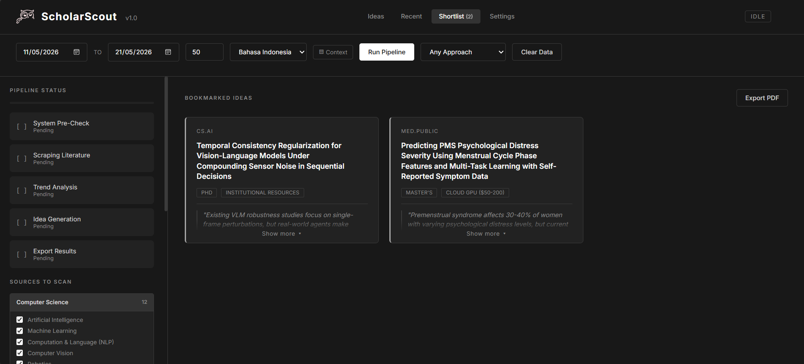

<p align="center">
  
</p>

<h3 align="center">Papers in. Ideas out.</h3>

<p align="center">
  ScholarScout reads 250M+ academic papers from 8 databases and generates actionable ideas<br>
  tailored to your goal: thesis, hackathon, SaaS product, literature review, or your next feature.
</p>

<p align="center">
  <a href="#quick-start">Quick Start</a> · 
  <a href="#four-modes">Four Modes</a> · 
  <a href="#features">Features</a> · 
  <a href="https://scholarscout.pages.dev/docs">Documentation</a> · 
  <a href="https://scholarscout.pages.dev">Live Demo</a> · 
  <a href="https://github.com/neej4/ScholarScout/blob/main/CHANGELOG.md">Changelog</a>
</p>

<p align="center">
  <a href="https://youtu.be/gz_UAxNOenw">
    
  </a>
  <a href="https://scholarscout.pages.dev">
    
  </a>
  <a href="https://ko-fi.com/scholarscout">
    
  </a>
</p>

<p align="center">
  
</p>

---

## Quick Start

```bash
git clone https://github.com/neej4/ScholarScout.git
cd ScholarScout
pip install -r requirements.txt
python preview_server.py
```

Open **http://localhost:5050** — the setup wizard walks you through in 30 seconds.

Need an LLM? Pick one:

| Provider | Cost | Speed | Setup |
|----------|------|-------|-------|
| **Gemini** | Free (15 req/min) | Fast | [Get key](https://aistudio.google.com/app/apikey) |
| **Groq** | Free tier | Very fast | [Get key](https://console.groq.com/keys) |
| **Ollama** | Free (local) | GPU-dependent | [Download](https://ollama.com/download) |
| **Custom** | Any | Any | Your local proxy (LM Studio, 9router) |
| OpenRouter | Pay-per-token | Varies | [Get key](https://openrouter.ai/keys) |
| OpenAI | Pay-per-token | Fast | [Get key](https://platform.openai.com/api-keys) |

---

## Four Modes

Same papers, four different lenses:

| Mode | You ask | You get |
|------|---------|---------|
| **Academic** | "What can I research?" | Thesis topics, methodology, key papers, novelty check |
| **Product** | "What can I build?" | MVP features, tech stack, revenue model, competitors |
| **Develop** | "What can I add to my project?" | Features, integrations, optimizations grounded in your codebase |
| **Review** | "What's the state of the field?" | Thematic clusters, synthesis per cluster, gaps, open questions, reading list |

**Develop** mode treats your project description as a hard constraint — every idea must be directly applicable.

**Review** mode doesn't generate ideas. It organizes and synthesizes existing papers into a literature review skeleton.

---

## Features

### Activity Center (v1.5.3)
- Owl Chase pixel art game while pipeline runs (papers spawn as dots you catch)
- Live graph showing papers grouped by category or cluster
- LLM Chat tab narrating what the AI is doing
- Adaptive phase list (5 phases default, 6 phases review)

### Intelligence
- Trend analysis with confidence scoring
- Anti-hallucination: P-number grounding (LLM can only cite fetched papers)
- Novelty check via semantic similarity (Gemini embeddings) or Jaccard fallback
- Quality scoring 1-10, low-quality filtered
- Deep dive: outline, methodology, datasets, timeline, tools, references
- Paper freshness: least-used papers prioritized, auto-widens date range when exhausted

### Data
- 8 sources: arXiv, OpenAlex, Semantic Scholar, PubMed, Crossref, DOAJ, Scopus, DBLP
- Smart source routing per category (medicine → PubMed+Scopus, CS → arXiv+DBLP)
- 80+ categories across 10 disciplines
- Cache-aware with expiry (7 days configurable)
- Citation-based sorting

### Personalization
- 18+ skill profiles (Academic, Product, Develop, Review)
- File upload (.pdf/.txt/.md/.json) as extra context
- Approach filter: Computational, Experimental, Clinical, Theoretical
- Onboarding wizard in 3 steps

### Dashboard
- Real-time SSE streaming
- Search, filter, bookmark, export PDF
- Session history (last 20 runs, review + default)
- Toast notifications (no browser alerts)
- Keyboard shortcuts

---

## Project Structure

```
ScholarScout/
├── preview_server.py           # Entry point
├── run_pipeline.py             # CLI pipeline runner
├── config.example.yaml         # Config template (copy to config.yaml)
├── src/
│   ├── core/
│   │   ├── orchestrator.py     # Pipeline controller (default + review)
│   │   ├── analyzer.py         # Trend analysis
│   │   ├── generator.py        # 4-mode idea generation
│   │   ├── clusterer.py        # Paper clustering (review mode)
│   │   ├── synthesizer.py      # Literature synthesis (review mode)
│   │   ├── deep_dive.py        # Deep dive analysis
│   │   ├── novelty_checker.py  # Novelty scoring
│   │   ├── llm.py              # Multi-provider LLM client (6 providers)
│   │   ├── config.py           # Configuration + thresholds
│   │   ├── models.py           # Dataclasses
│   │   └── fetchers/           # 8 source fetchers
│   └── web/
│       ├── routes/             # Flask blueprints
│       ├── templates/          # Dashboard HTML
│       └── static/             # JS, sprites, owl game
├── skills/                     # ACADEMIC/ PRODUCT/ DEVELOP/ REVIEW/
├── tests/                      # 90+ automated tests
└── data/                       # Cache, snapshots, history (gitignored)
```

---

## CLI Usage

```bash
# Academic mode
SCOUT_GOAL="THESIS" SCOUT_CATEGORIES="cs.AI,cs.CL" python run_pipeline.py

# Product mode
SCOUT_GOAL="HACKATHON" python run_pipeline.py

# Develop mode
SCOUT_GOAL="FEATURE" SCOUT_CONTEXT="Flask app with LLM integration" python run_pipeline.py

# Review mode
SCOUT_GOAL="SYNTHESIS" SCOUT_CONTEXT="federated learning for healthcare" python run_pipeline.py
```

---

## Testing

```bash
pip install -e ".[dev]"
pytest tests/ --ignore=tests/integration    # Unit tests
npm test                                     # JavaScript tests
```

---

## Contributing

See [CONTRIBUTING.md](CONTRIBUTING.md). High-impact areas:

- **New fetchers**: implement `BaseFetcher` (1 file, ~150 LOC)
- **New skill profiles**: add markdown to `skills/`
- **Prompt improvements**: `generator.py`, `analyzer.py`, `synthesizer.py`
- **New categories**: update `KEYWORD_SEEDS` + fetcher mappings

---

## Support

If ScholarScout saved you time, consider supporting:

- [Ko-fi](https://ko-fi.com/scholarscout) (International)
- [Saweria](https://saweria.co/scholarscout) (Indonesia)
- Star this repo

---

## License

MIT — see [LICENSE](LICENSE).
